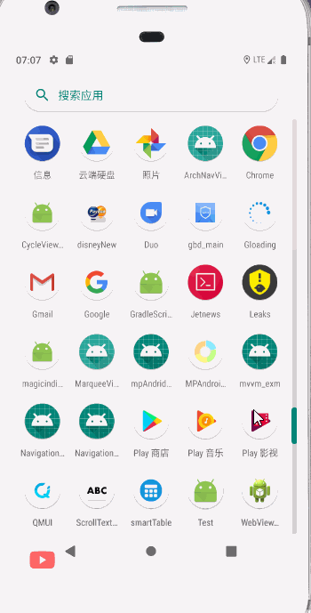
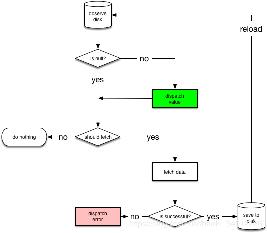
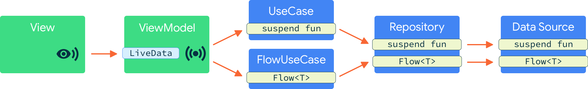

# mvvm_exm
一个MVVM架构单Activity的Android工程

## Demo示例


该示例用Navigation进行页面管理

解决了下面几个问题：
## 闪屏页面用Navigation怎么实现
### 方法一：Theme
当向用户显示初始屏幕达几秒钟时，通常会滥用初始屏幕，并且用户在已经可以与应用程序交互的同时浪费时间在初始屏幕上。取而代之的是，您应该尽快将它们带到可以与应用程序交互的屏幕。因此，以前的Splash屏幕在Android上被视为反模式。但是Google意识到，用户单击图标与您的第一个应用程序屏幕之间仍然存在短暂的窗口，可以进行交互，在此期间，您可以显示一些品牌信息。这是实现启动屏幕的正确方法。

因此，以正确的方式实施“启动画面”时，您不需要单独的“启动画面片段”，因为这会导致App加载过程中不必要的延迟。为此，您只需要特殊的主题。理论上讲，App主题可以应用于UI，并且比您的App UI初始化并变得可见的时间要早​​得多。简而言之，您只需要这样的SplashTheme即可：
```java
<style name="SplashTheme" parent="Theme.AppCompat.NoActionBar">
    <item name="android:windowBackground">@drawable/splash_background</item>
</style>
```
splash_background:
```java
<?xml version="1.0" encoding="utf-8"?>
<layer-list xmlns:android="http://schemas.android.com/apk/res/android"
    android:opacity="opaque"> <!-- android:opacity="opaque" should be here -->
    <item>
        <color android:color="@color/colorPrimary" />
    </item>
    <item>
        <bitmap
            android:antialias="true"
            android:filter="true"
            android:src="@drawable/splash" />
    </item>
</layer-list>
```
```java
<activity android:name=".ui.MainActivity"
              android:theme="@style/SplashTheme">
```
MainActivity:
```java
override fun onCreate(savedInstanceState: Bundle?) {
    setTheme(R.style.AppTheme)
    super.onCreate(savedInstanceState)
    .....
}
```
### 方法二：popUpToInclusive
```java
 <fragment
        android:id="@+id/splashFragment"
        android:name="com.siy.mvvm.exm.ui.splash.SplashFragment"
        android:label="SplashFragment">
        <action
            android:id="@+id/action_splashFragment_to_loginFragment"
            app:destination="@id/loginFragment"
            app:popUpTo="@id/splashFragment"
            app:popUpToInclusive="true" />
    </fragment>
 
    <fragment
        android:id="@+id/loginFragment"
        android:name="com.siy.mvvm.exm.ui.login.LoginFragment"
        android:label="LoginFragment"
        tools:layout="@layout/fragment_login">
        <action
            android:id="@+id/action_loginFragment_to_mainFragment"
            app:destination="@id/mainFragment" />
    </fragment>
```
注意action的属性：
```java
app:popUpTo="@id/splashFragment"       
app:popUpToInclusive="true"
```
用代码也可以实现同样的效果：
```java
navController.navigateAnimate(
                SplashFragmentDirections.actionSplashFragmentToLoginFragment(),
                navOptions {
                    popUpTo(R.id.splashFragment) {
                        inclusive = true
                    }
                })
```
个人比较喜欢用代码实现。
解释一下：
```java
 /**
     * Pop up to a given destination before navigating. This pops all non-matching destinations
     * from the back stack until this destination is found.
     */
    fun popUpTo(@IdRes id: Int, popUpToBuilder: PopUpToBuilder.() -> Unit) {
        popUpTo = id
        inclusive = PopUpToBuilder().apply(popUpToBuilder).inclusive
    }
```
popUpTo: 导航之前，弹出至给定的目的地。这将从后堆栈中弹出所有不匹配的目标，直到找到该目标为止。

id:弹出目的地，清除所有中间目的地。

inclusive:如果为true，也会从后堆栈中弹出给定的目标,false不会
## startActivityForResult用Navigation怎么实现
你在文档和官方demo中都找不到相关的内容，但是可以找到这么一句话

> 通常，强烈建议您仅在目标之间传递最少的数据量。例如，您应该传递键来检索对象而不是传递对象本身，因为所有保存状态的总空间在Android上受到限制。如果需要传递大量数据，请考虑使用ViewModel，如在Fragments之间共享数据中所述。

Navigation推荐使用ViewModel在Fragment之间共享数据，这种方式在startActivityForResult并不友好。因此Google Issue Tracker有这么一个Issue：[Navigation: startActivityForResult analog](https://issuetracker.google.com/issues/79672220)，但是它的优先级并不高。所以在官方给出解决方案之前我这有一种解决方式。
##### 1、定义一个这样的接口
```java
interface NavigationResult {
    fun onNavigationResult(result: Bundle)
```
##### 2、将下面的方法添加到您的Activity中
```java
fun navigateBackWithResult(result: Bundle) {
        val childFragmentManager =
            supportFragmentManager.findFragmentById(R.id.nav_host_fragment)?.childFragmentManager
        var backStackListener: FragmentManager.OnBackStackChangedListener by Delegates.notNull()
        backStackListener = FragmentManager.OnBackStackChangedListener {
            (childFragmentManager?.fragments?.get(0) as NavigationResult).onNavigationResult(result)
            childFragmentManager.removeOnBackStackChangedListener(backStackListener)
        }
        childFragmentManager?.addOnBackStackChangedListener(backStackListener)
        navController().popBackStack()
    }
```
因为从另一个Fragment分发的结果必须要经过Activity路由。
##### 3、在您要接受结果的Fragment中实现NavigationResult
## Navigation视图的状态保存
Google Issue Tracker有2个相关的Issue:

[Open fragment without lose the previous fragment states](https://issuetracker.google.com/issues/127932815)

[Transaction type is not available with Navigation Architecture Component](https://issuetracker.google.com/issues/109856764)

可以看到这2个问题下面google工程师给出的回答是：Status: Won't Fix (Intended Behavior)。
 
那么这个问题真的没有解决方案么？最终我在[Ian Lake(Android Toolkit Developer and Runner)](https://twitter.com/ianhlake/)的twitter下面找到了答案。关于这个问题的Twitter原文地址：https://twitter.com/ianhlake/status/1103522856535638016
 
> 您不必每次调用onCreateView时都为新视图inflater-您可以保留对您第一次创建的View的引用，然后再次返回它。请记住，即使不缓存视图本身，Fragment视图也会自动保存和恢复其状态。如果不是这种情况，则应首先解决该问题(确保视图具有android：id等)

为什么要确保视图有id才能自动缓存视图？答案[看这里](http://www.jcodecraeer.com/a/anzhuokaifa/androidkaifa/2015/0512/2870.html)
## 数据管理
# a、NetworkBoundResource


这个图也是来自于Android应用架构指南。

它首先观察资源的数据库。首次从数据库中加载条目时，NetworkBoundResource会检查结果是好到足以分派，还是应从网络中重新获取。请注意，考虑到您可能会希望在通过网络更新数据的同时显示缓存的数据，这两种情况可能会同时发生。

如果网络调用成功完成，它会将响应保存到数据库中并重新初始化数据流。如果网络请求失败，NetworkBoundResource 会直接分派失败消息。

Tips:

注意：在将新数据保存到磁盘后，我们会重新初始化来自数据库的数据流。不过，通常我们不需要这样做，因为数据库本身正好会分派更改。

请注意，依赖于数据库来分派更改将产生相关副作用，这样不太好，原因是，如果由于数据未更改而使得数据库最终未分派更改，就会出现这些副作用的未定义行为。

此外，不要分派来自网络的结果，因为这样将违背单一可信来源原则。毕竟，数据库可能包含在“保存”操作期间更改数据值的触发器。同样，不要在没有新数据的情况下分派 `SUCCESS`，因为如果这样做，客户端会接收错误版本的数据。

Kotlin代码实现也可以在google的官方demo中找到：[NetworkBoundResource](https://github.com/android/architecture-components-samples/blob/88747993139224a4bb6dbe985adf652d557de621/GithubBrowserSample/app/src/main/java/com/android/example/github/repository/NetworkBoundResource.kt)

Java版：[NetworkBoundResource](https://www.programcreek.com/java-api-examples/?code=googlesamples%2Fandroid-architecture-components%2Fandroid-architecture-components-master%2FGithubBrowserSample%2Fapp%2Fsrc%2Fmain%2Fjava%2Fcom%2Fandroid%2Fexample%2Fgithub%2Frepository%2FNetworkBoundResource.java#)

协程版：[CoroutineNetworkBoundResource](https://github.com/android/architecture-components-samples/blob/move-repo-to-buildLiveData-4/GithubBrowserSample/app/src/main/java/com/android/example/github/repository/CoroutineNetworkBoundResource.kt)

关于kotlin协程与架构组件一起使用的文档[在这里](https://developer.android.google.cn/topic/libraries/architecture/coroutines#suspend)

为什么要用协程实现这个呢？因为Room 和 retrofit2-2.6.0都支持协程的支持用起来很方便

还有一个优点：liveData构建块用作协程和LiveData之间的结构化并发原语。当LiveData变为活动状态时，该代码块开始执行；当LiveData变为非活动状态时，该代码块在可配置的超时后自动取消。如果在完成之前将其取消，则如果LiveData再次变为活动状态，它将重新启动。如果它在先前的运行中成功完成，则不会重新启动。请注意，只有自动取消后，它才会重新启动。如果由于任何其他原因取消了该块(例如，引发CancelationException)，则不会重新启动它。

# b、ADS
在[Android Dev Summit (ADS) 2019 app](https://medium.com/androiddevelopers/lessons-learnt-using-coroutines-flow-4a6b285c0d06)中的最佳实践中又提出了一种应用程序体系结构，它遵循[Android应用架构指南](https://developer.android.google.cn/jetpack/docs/guide#recommended-app-arch)并添加了一个UseCases层，该层有助于分离关注点，使类保持小巧，集中，可重用和可测试：



与许多Android应用程序一样，ADS应用程序也从网络或缓存中延迟加载数据；我们发现这是的理想用例Flow。对于单次请求操作，[suspend functions](https://medium.com/androiddevelopers/coroutines-on-android-part-iii-real-work-2ba8a2ec2f45) 更合适。

ADS应用程序所遵循的原则LiveData，即不将其LiveData用于体系结构的所有层，仅用于View和ViewModel之间的通信，而协程用于UseCase和体系结构的较低层。

因为这个原因NetworkBoundResource又多了一个Flow的版本

Flow版：[FlowNetworkBoundResource.kt](https://github.com/Siy-Wu/mvvm_exm/blob/master/app/src/main/java/com/siy/mvvm/exm/base/repository/FlowNetworkBoundResource.kt)

Flow版参考[这里](https://stackoverflow.com/questions/58486364/networkboundresource-with-kotlin-coroutines)实现

有关的介绍视频：https://www.jianshu.com/p/52f30bcf1945

详细内容可以查看这边文章：https://blog.csdn.net/baidu_34012226/article/details/102458177
